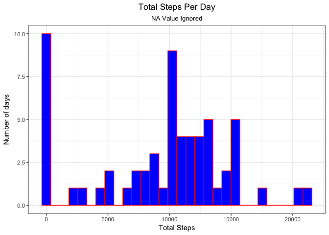
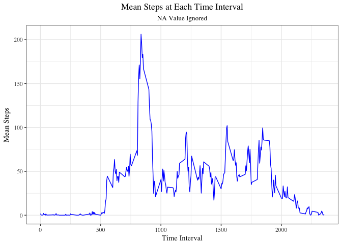
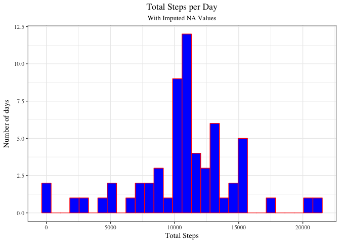
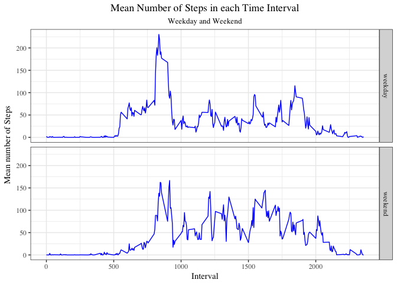

## Loading and preprocessing the data


```r
library(tidyverse)
```


```r
if(!file.exists("Data")) dir.create("Data")
if(!file.exists("./Data/activity.csv")){
        unzip("./activity.zip", exdir = "./Data")}
data <- read.csv("./Data/activity.csv")
# change type of each element in date
data$date <- as.Date(data$date, "%Y-%m-%d")
summary(data)
```

```
##      steps             date               interval     
##  Min.   :  0.00   Min.   :2012-10-01   Min.   :   0.0  
##  1st Qu.:  0.00   1st Qu.:2012-10-16   1st Qu.: 588.8  
##  Median :  0.00   Median :2012-10-31   Median :1177.5  
##  Mean   : 37.38   Mean   :2012-10-31   Mean   :1177.5  
##  3rd Qu.: 12.00   3rd Qu.:2012-11-15   3rd Qu.:1766.2  
##  Max.   :806.00   Max.   :2012-11-30   Max.   :2355.0  
##  NA's   :2304
```


## What is mean total number of steps taken per day?

### Make a histogram of the total number of steps taken each day with NA value ignored

```r
data %>% group_by(date) %>%
                summarize(totalSteps = sum(steps, na.rm = TRUE)) %>%
                ggplot() +
                geom_histogram(aes(totalSteps), col = "red", fill = "blue") +
                labs(x = "Total Steps", 
                     y = "Number of days", 
                     title = "Total Steps Per Day",
                     subtitle = "NA Value Ignored") +
                theme_bw()+
                theme(plot.title = element_text(hjust = 0.5), 
                      plot.subtitle = element_text(hjust = 0.5))
```

<!-- -->

### Calculate and report the mean and median total number of steps per day

```r
data %>% group_by(date) %>%
        summarize(totalSteps = sum(steps, na.rm = TRUE)) %>%
        summarize(median = median(totalSteps), mean = mean(totalSteps))
```

```
## # A tibble: 1 x 2
##   median  mean
##    <int> <dbl>
## 1  10395 9354.
```

## What is the average daily activity pattern?

### Time series plot of a 5-minute inteval and the average number of steps taken average cross all days

```r
data %>% group_by(interval) %>%
        summarize(meanSteps = mean(steps, na.rm=TRUE)) %>%
        ggplot() +
        geom_line(aes(x = interval, y = meanSteps), color = "blue") +
        labs(x = "Time Interval",
             y = "Mean Steps",
             title = "Mean Steps at Each Time Interval",
             subtitle = "NA Value Ignored") +
        theme_bw(base_family = "Times") +
        theme(plot.title = element_text(hjust = 0.5),
              plot.subtitle = element_text(hjust = 0.5))
```

<!-- -->

### Which 5-minute interval. on average cross all days in the dataset. contains the maximum number of steps?

```r
df1<- data %>% group_by(interval) %>%
                summarize(meanSteps = mean(steps, na.rm=TRUE)) 
mm <- df1 %>% filter(meanSteps == max(meanSteps))
print(mm)
```

```
## # A tibble: 1 x 2
##   interval meanSteps
##      <int>     <dbl>
## 1      835      206.
```

Time interval start with **835** on average cross all days in the dataset contains the maximum number of steps.

## Imputing missing values

### Calculate and report the total number of missing data

```r
MissingValue <- data.frame(totalMissing = sum(is.na(data$steps)),
                        proportionMissing = mean(is.na(data$steps)))
print(MissingValue)
```

```
##   totalMissing proportionMissing
## 1         2304         0.1311475
```
Total number of missing data is **2304**.

### Fill in all of the missing value and creat a new dataset with missing value filled

Using mean of each time interval cross all days to fill the missing value.


```r
df2 <- data
df2 <- df2 %>% mutate(meanSteps = rep(df1$meanSteps, length(unique(df2$date))))
df2$steps <- ifelse(is.na(df2$steps), df2$meanSteps, df2$steps)
df2 <- df2 %>%
        select(steps, date, interval)
head(df2)
```

```
##       steps       date interval
## 1 1.7169811 2012-10-01        0
## 2 0.3396226 2012-10-01        5
## 3 0.1320755 2012-10-01       10
## 4 0.1509434 2012-10-01       15
## 5 0.0754717 2012-10-01       20
## 6 2.0943396 2012-10-01       25
```


### Make a histogram with the new dataset with missing value filled

```r
df2 %>% group_by(date) %>%
        summarize(totalSteps = sum(steps)) %>%
        ggplot() +
        geom_histogram(aes(x=totalSteps), col = "red", fill = "blue") +
        labs(x = "Total Steps",
             y = "Number of days",
             title = "Total Steps per Day",
             subtitle = "With Imputed NA Values") +
        theme_bw(base_family = "Times") +
        theme(plot.title = element_text(hjust = 0.5),
              plot.subtitle = element_text(hjust = 0.5))
```

<!-- -->

### Report the mean and median total number of steps taken per day

```r
df2 %>% group_by(date) %>%
        summarize(totalSteps = sum(steps)) %>%
        summarize(meanSteps = mean(totalSteps), 
                  medianSteps = median(totalSteps))
```

```
## # A tibble: 1 x 2
##   meanSteps medianSteps
##       <dbl>       <dbl>
## 1    10766.      10766.
```
We can clearly observe the new mean and median total number of steps taken per day with the missing value filled
dataset are differ from the outputs from orginal dataset (when we ignore the missing value).  
In fact, when we ignored the missing value, the number of steps we used to calculate the total number of steps in that particular time interval will be zero, which will significant reduce the total number of steps we observed in each day with missing values.
This meanings if we imputing the missing data, both of mean and median of total daily number of steps would have significant increase, this conclusion is agreed with our observation.


## Are there differences in activity patterns between weekdays and weekends?


```r
df2 %>% # create a new column indicate whether given date is weekday or weekend
        mutate(Day = ifelse(weekdays(date) %in% c("Saturday", "Sunday"),
                            "weekend", "weekday")) %>%
        # calculate mean steps in each time interval in each Day category
        group_by(Day, interval) %>%
        summarize(meanSteps = mean(steps)) %>%
        # make the plot
        ggplot() +
        geom_line(aes(x = interval, y = meanSteps), color = "blue") +
        facet_grid(Day~.) +
        labs(x = "Interval",
             y = "Mean number of Steps",
             title = "Mean Number of Steps in each Time Interval",
             subtitle = "Weekday and Weekend") +
        theme_bw(base_family = "Times") +
        theme(plot.title = element_text(hjust = 0.5),
              plot.subtitle = element_text(hjust = 0.5))
```

<!-- -->
